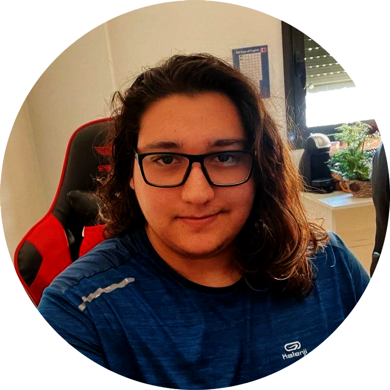
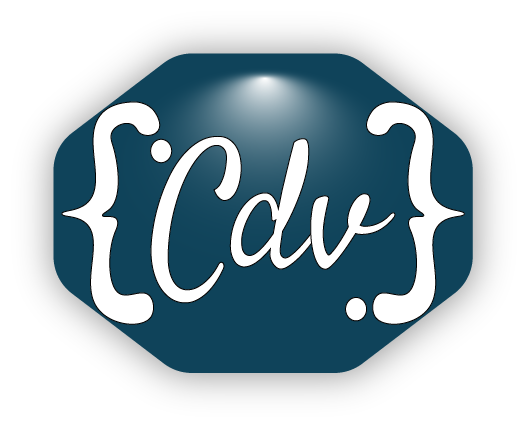

## Hello, I'm Cristian 👋



### Check my portfolio

[criscandv.com](https://criscandv.com/en)

- 👨🏻‍💻 Software Engineer. JavaScript and Python Lover.
- 🌱 5 years in programming ...
- 👯 Love team work ...
- 📙 Learning new technologies ...

## About me...

```js
const criscandv = {
  type: "Fullstack developer",
  languages: ["Spanish", "English"],
  skills: {
    python: ["Django", "Flask", "SQLAlchemy", "Celery"],
    javascript: [
      "Node.js",
      "Express",
      "React",
      "Next.js",
      "Vue",
      "TypeScript",
      "GraphQL",
    ],
    databases: ["PostgreSQL", "MySQL", "MongoDB", "SQLite", "redis"],
    continousIntegration: ["Gitlab CI/CD", "Jenkins", "Ansible"],
    servers: ["Linux", "AWS", "Docker", "Nginx", "Apache"],
    css: ["Tailwind", "PostCSS", "ChakraUI", "Vuetify", "Bootstrap"],
    versionControl: ["Git"],
  },
  links: {
    criscandv: "https://criscandv.com",
    github: "https://github.com/criscandv",
    linkedin: "https://linkedin.com/in/criscandv",
    twitter: "https://twitter.com/criscandv",
    instagram: "https://instagram.com/criscandv",
  },
};
```

<p align="center">
  
</p>
